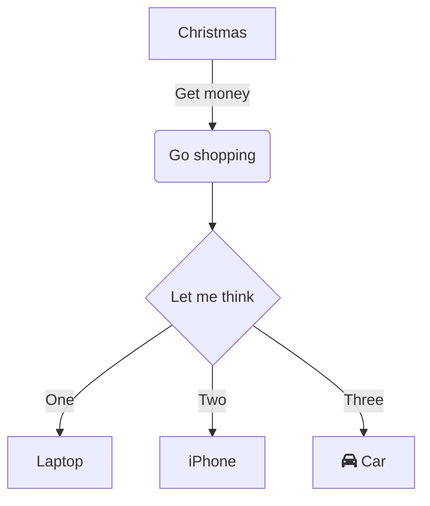
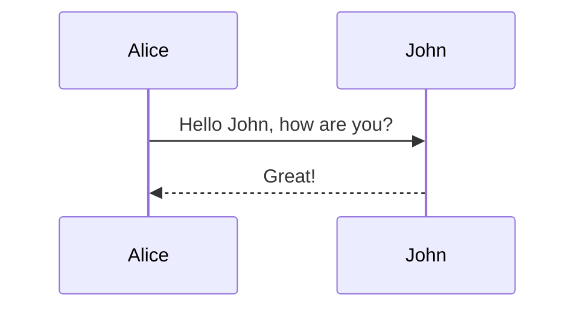
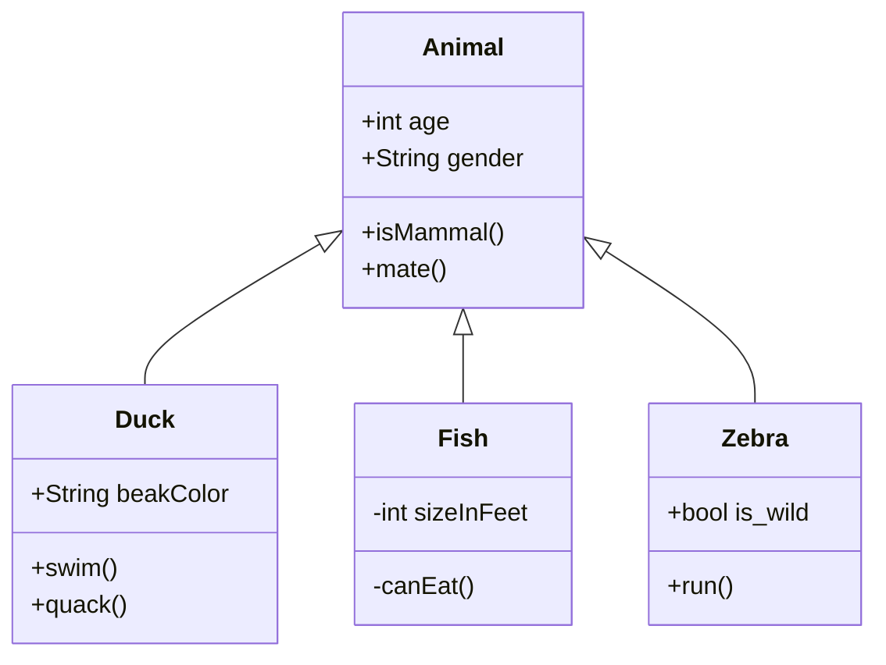
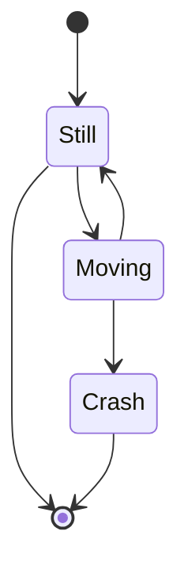
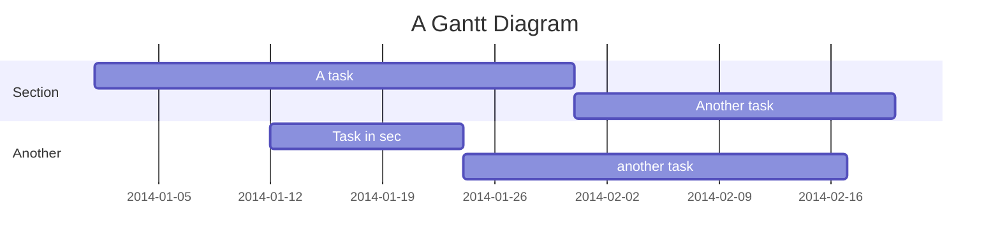
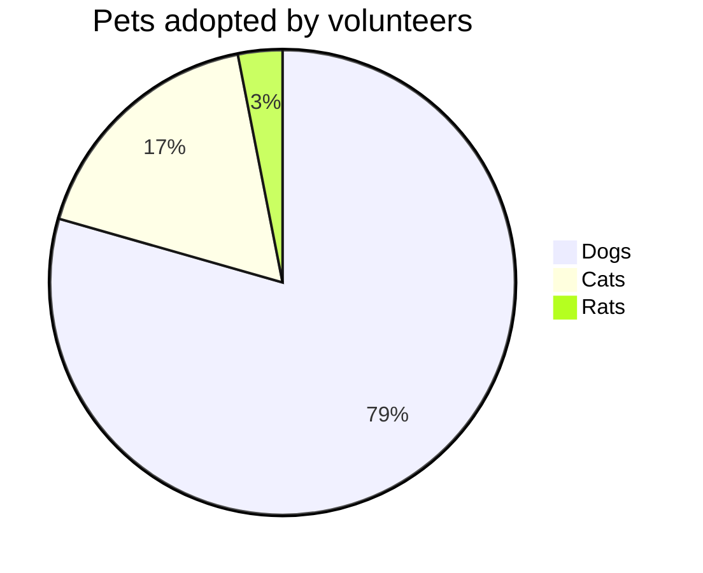

Test post

JavaScript

```javascript
const foo = 'bar'
const bah = 'foo'
```

C#

```csharp
var x = 5;
```

## Heading

Mermaid













Nomnoml

```nomnoml
[Pirate|eyeCount: Int|raid();pillage()|
  [beard]--[parrot]
  [beard]-:>[foul mouth]
]

[<abstract>Marauder]<:--[Pirate]
[Pirate]- 0..7[mischief]
[jollyness]o->[Pirate]
[jollyness]--:>[rum]
[jollyness]-[singing]
[Pirate]-> *[rum|tastiness: Int|swig()]
[Pirate]->[singing]
[singing]<->[rum]

[<start>st]->[<state>plunder]
[plunder]->[<choice>more loot]
[more loot]->[st]
[more loot] no ->[<end>e]

[<actor>Sailor] - [<usecase>shiver me;timbers]
```
